# Emotion Check-in System Frontend (React + Vite)

The **frontend** of the Emotion Check-in System, built with **React + Vite + TypeScript**.  
It provides an intuitive and responsive dashboard for employees to check in daily with their emotional state, while offering HR and Super Admins powerful analytics, insights, and management tools to support employee well-being. The frontend is designed with a strong focus on **clean code architecture, performance optimization, reusability, and exceptional developer experience**.

---

# Previews

## Login Page


## Sentiments Dashboard
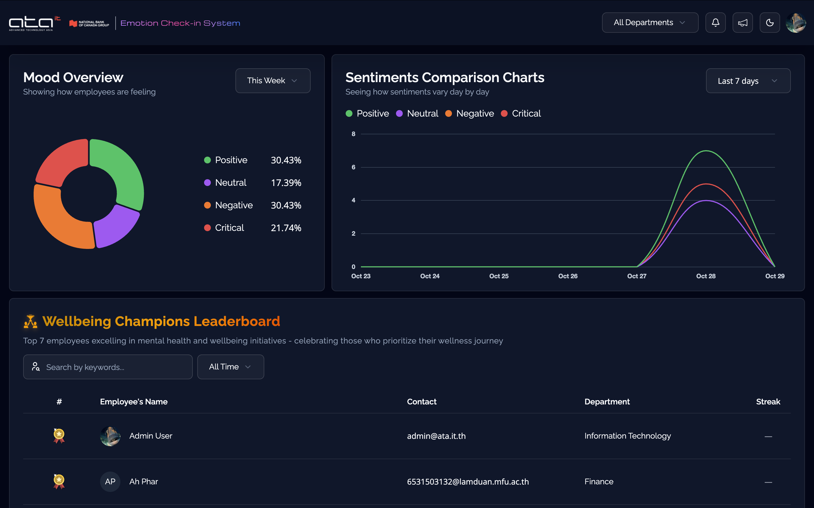
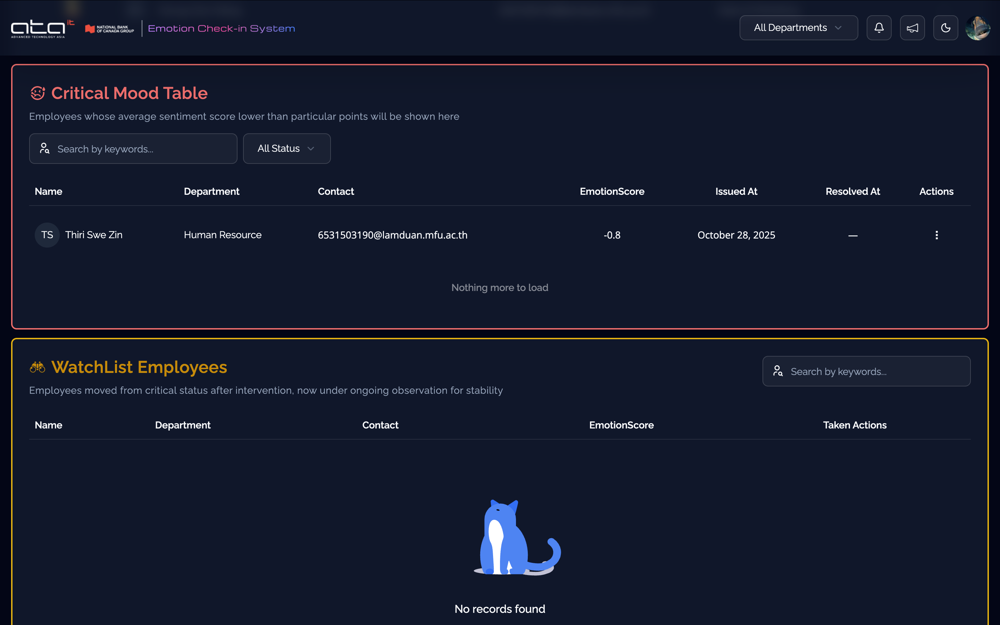
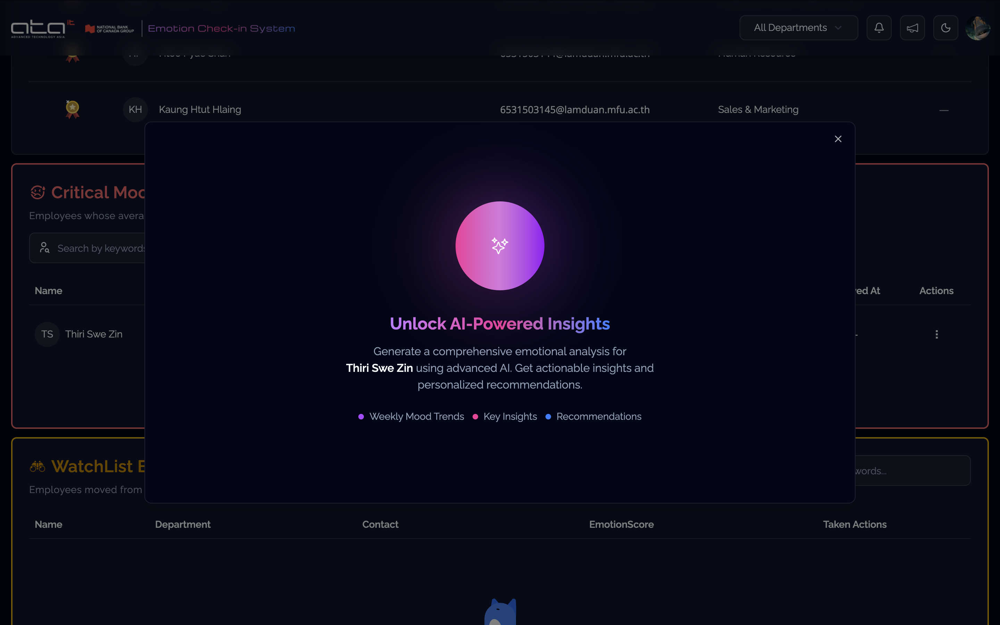
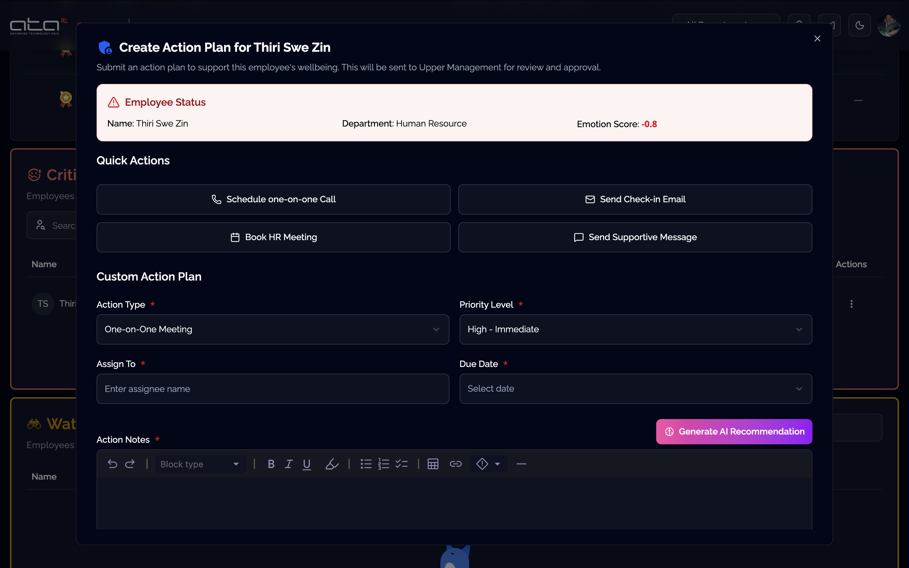
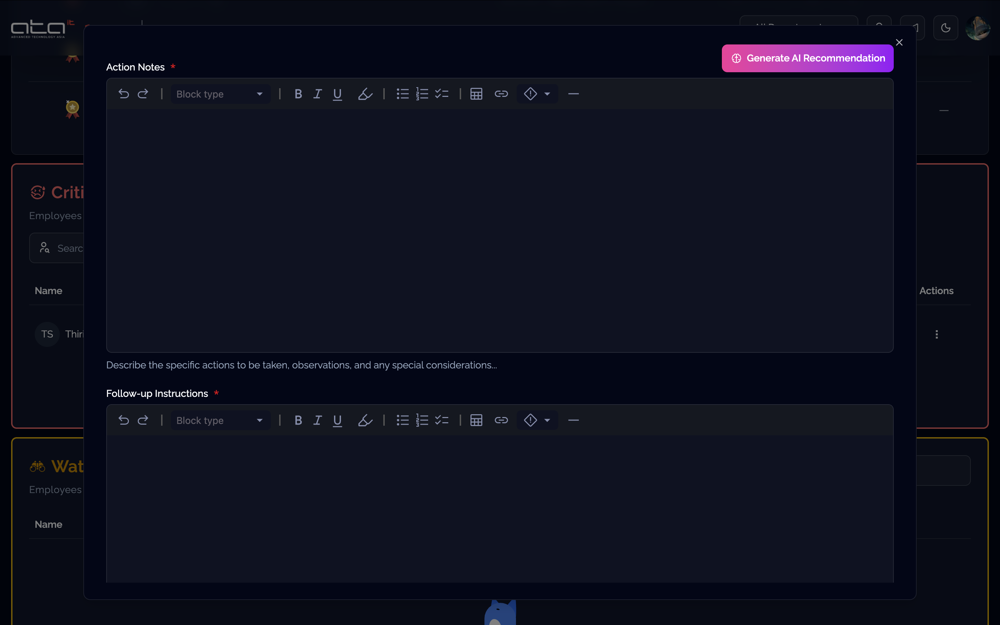

## Attendance Dashboard
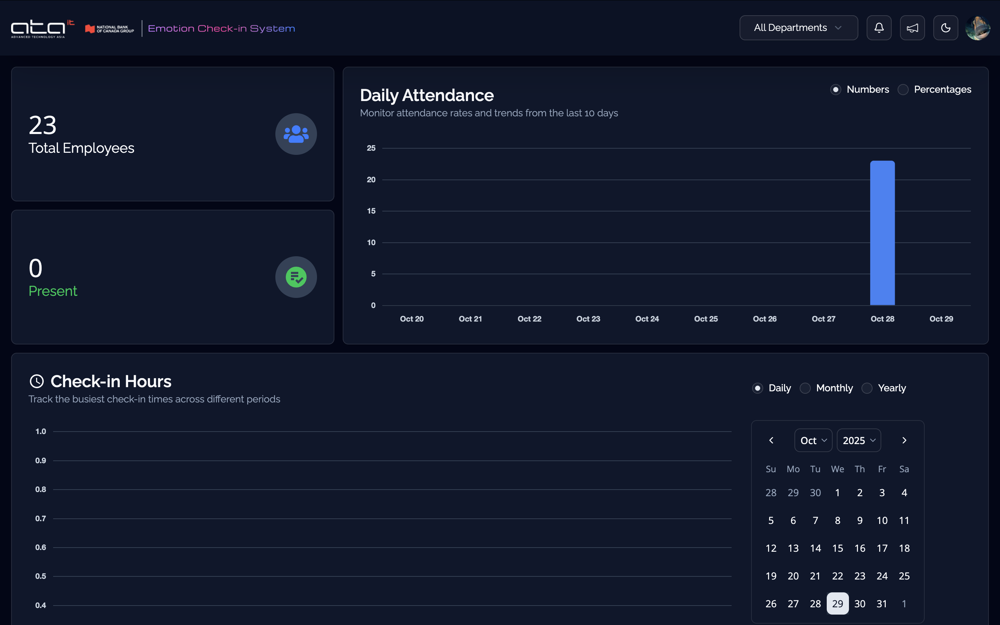
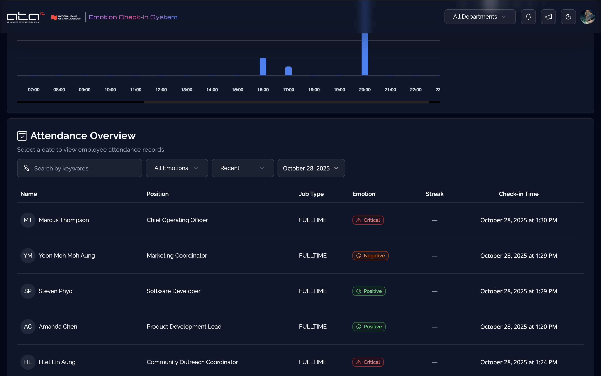

## Analytics & Insights Dashboard
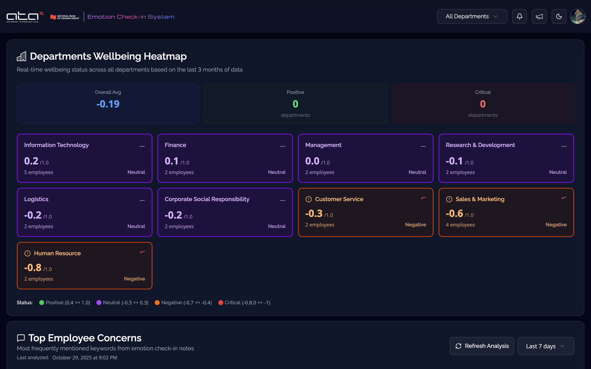
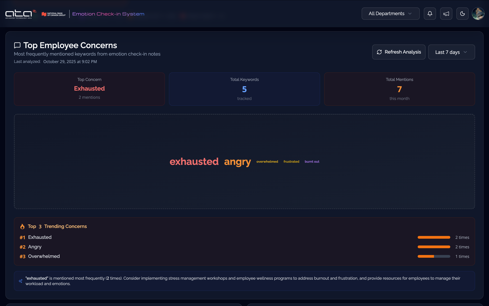
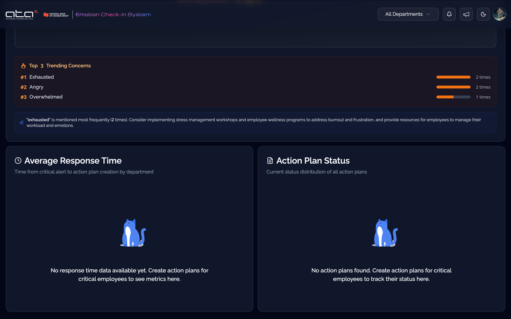

## General Management Dashboard
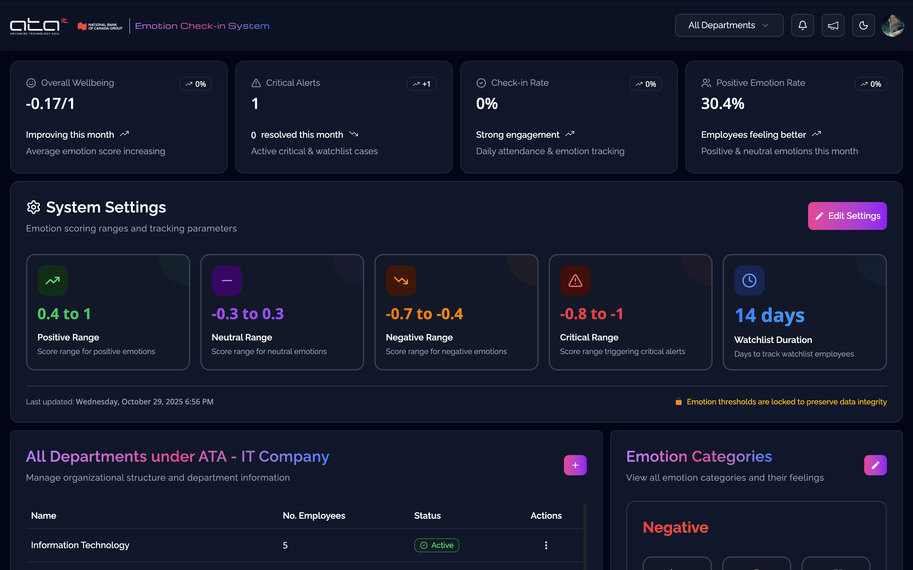
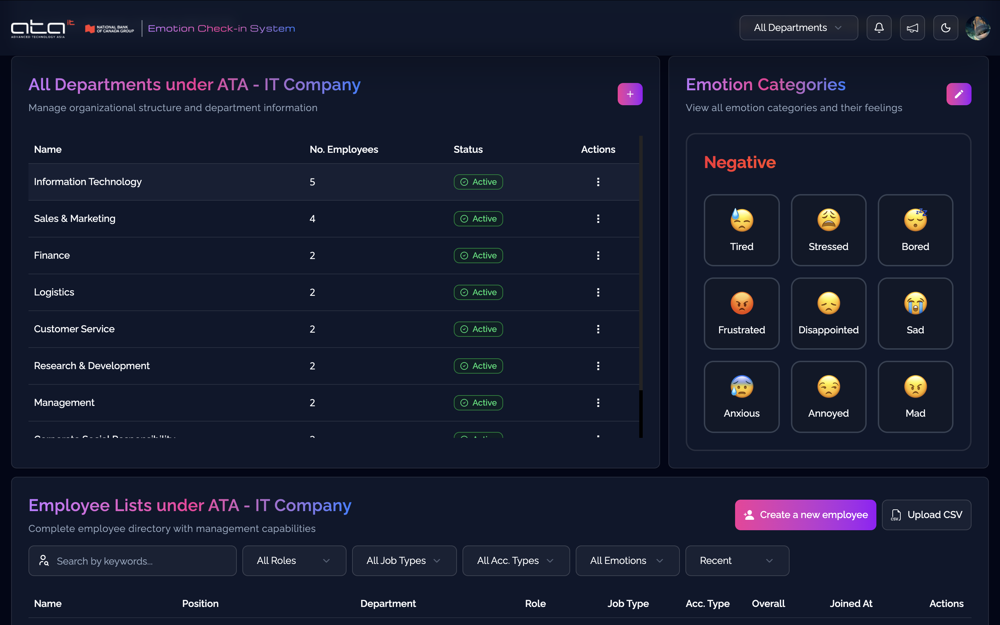

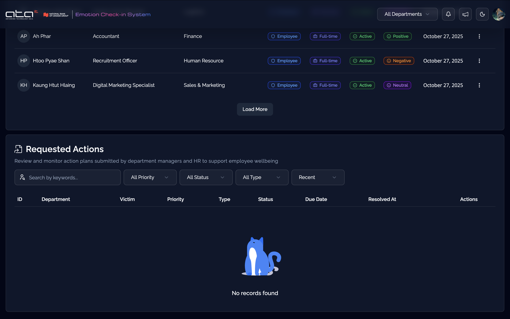
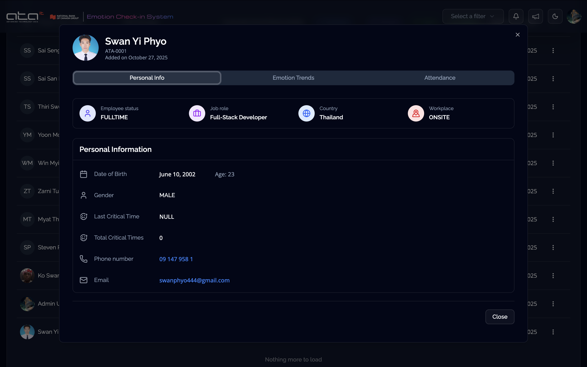
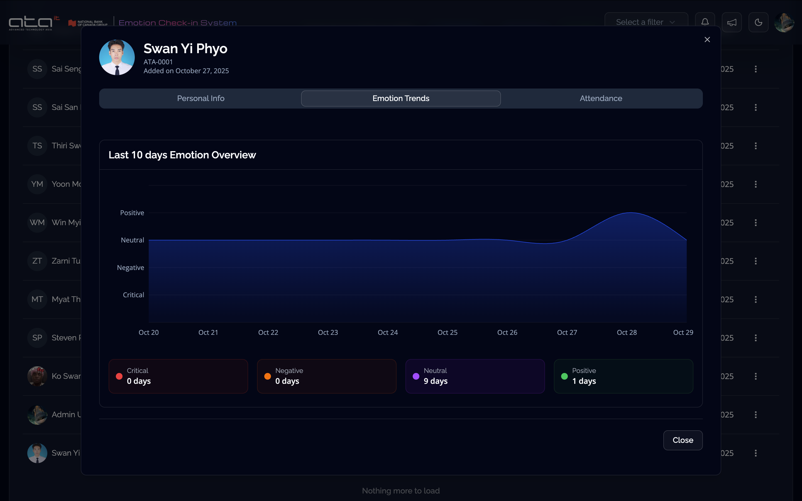
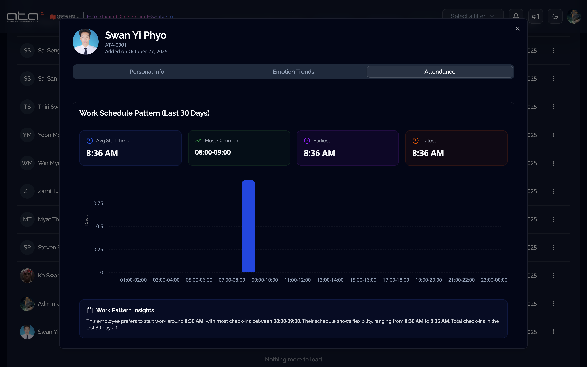


---

## 📑 Table of Contents
- [Features](#features)
- [Tech Stack](#tech-stack)
- [Folder Structure](#folder-structure)
- [Environment Variables](#environment-variables)
- [Scripts](#scripts)
- [Run Locally](#run-locally)
- [Notes](#notes)

---

## Features

### Authentication & User Management
- **Complete Auth Flow**: Login, registration with OTP verification, password reset, and secure session management
- **Role-Based Access Control (RBAC)**: Seamless routing and UI adaptation for Employee, Admin, and Super Admin roles
  - **Admin Role**: Access restricted to Sentiments and Attendance dashboards, with data scoped to their assigned department
  - **Super Admin Role**: Full access to all 4 dashboards (Sentiments, Attendance, Analytics & Insights, General Management) with company-wide visibility
  - **Department-Level Filtering**: Admin users automatically see department-specific data, while Super Admins can filter and compare across all departments
- **Session Persistence**: Automatic token refresh and auth state management with Zustand

### Employee Experience
- **Daily Check-in**: Intuitive emotion selection with emoji interface and optional text notes
- **Personal History**: View complete check-in history with search, filters, and infinite scrolling
- **Attendance Tracking**: Automatic attendance recording integrated with emotional check-ins

### Admin Analytics Dashboard
- **Role-Based Dashboard Access**: 
  - Admins: Access to Sentiments and Attendance dashboards only
  - Super Admins: Access to all 4 dashboards (Sentiments, Attendance, Analytics & Insights, General Management)
- **Department-Scoped Data**:
  - Admin users see data filtered to their assigned department automatically (e.g., IT Admin sees only IT department metrics)
  - Super Admin users can view all departments with advanced multi-select filters for cross-department comparisons
- **Comprehensive Visualizations**: Rich charts and graphs powered by Recharts and Chart.js
  - Mood trends overview over time Pie Chart
  - Sentiment comparison Line Chart
  - Daily Attendance Showcase Bar Chart with overview calendars
  - Check-in hours showcase Bar Chart
  - Average Action Plan Response Time Bar Chart
  - Action Plan Status tracking Pie Chart
  - Employee's attendance time overview Bar Chart
  - Employee's emotion check-in trends Area Chart
- **Real-time Insights**: Live data updates showing current emotional climate across the organization (department-filtered for Admins)
- **Critical Alerts**: Instant notifications for employees requiring immediate attention (department-scoped)
- **Watchlist Management**: Track and monitor at-risk employees with detailed emotional history (department-restricted for Admins)
- **AI-Powered Analysis**: View AI-generated insights, trend analysis, and recommendations (department-scoped for Admins)
- **Word Cloud Visualization**: Interactive word cloud showing top employee concerns and themes (department-filtered)
- **Leaderboard System**: Recognize positive engagement and emotional resilience (department-specific for Admins)

### Action Plan Management
- **Create & Track**: Design intervention plans with deadlines, notes, and status tracking
- **Rich Text Editor**: MDX Editor integration for detailed, formatted action plans with:
  - Bold, italic, underline, and strikethrough text
  - Tables for structured information
  - Bullet and numbered lists
  - Code blocks and inline code
  - Links and highlights
  - Headers and blockquotes
- **Progress Monitoring**: Visual indicators for overdue, upcoming, and completed plans
- **Searchable Interface**: Advanced search and filtering across all action plans

### Communication & Announcements
- **Rich Announcements**: Create organization-wide announcements with the MDX Editor
- **File Attachments**: Upload and share images, PDFs, and documents with announcements
- **Notification Center**: Real-time notifications with read/unread status and quick actions
- **Infinite Scroll**: Seamless pagination for notifications and announcements

### Super Admin Management
- **Employee Management**: Full CRUD operations for user accounts with advanced search
- **Bulk Import**: CSV upload interface for mass employee registration
- **Department Management**: Create, update, and delete departments with employee assignment
- **Emotion Categories Management**: Configure and customize emotion categories used in the mobile app for employee check-ins
- **System Settings Control**: Define and adjust metrics for emotion check-in score calculation and system-wide configurations
- **Action Plan Oversight**: View, edit, and manage all action plans across the organization

### Data Visualization & Insights
- **Interactive Charts**: Beautiful, responsive charts with tooltips and drill-down capabilities
- **Multiple Chart Types**: Line, bar, pie, area, radar, and heatmap visualizations
- **Export Capabilities**: Download charts and reports for presentations
- **Customizable Views**: Filter by date range, department, severity, and more
- **Advanced Department Filtering**:
  - Super Admins can filter and compare data across all departments with multi-select capabilities
  - Admin users automatically see department-scoped data without filtering options
  - Real-time chart updates when department filters are applied
- **Comparison Tools**: Side-by-side department and time period comparisons (Super Admin only)

### User Interface & Experience
- **Responsive Design**: Seamless experience across desktop, tablet, and mobile devices
- **Dark Mode Support**: Eye-friendly dark theme for extended usage
- **Accessible Components**: WCAG-compliant UI elements powered by shadcn/ui
- **Smooth Animations**: Polished transitions and micro-interactions
- **Loading States**: Skeleton loaders and progress indicators for better UX
- **Error Handling**: User-friendly error messages with actionable suggestions

### Search & Filtering
- **Advanced Search**: Powerful search across check-ins, employees, and action plans
- **Multi-Criteria Filters**: Filter by date range, emotion type, department, severity, and status
- **Real-time Results**: Instant search results as you type
- **Saved Filters**: Save frequently used filter combinations
- **Infinite Scrolling**: Efficient data loading with virtual scrolling for large datasets

### Performance & Optimization
- **Code Splitting**: Lazy loading for optimal bundle sizes
- **Caching Strategy**: TanStack Query for intelligent data caching and background updates
- **Optimistic Updates**: Instant UI feedback before server confirmation
- **Debounced Inputs**: Reduced API calls for search and filter operations
- **Memoization**: React optimization hooks for preventing unnecessary re-renders

---

## Tech Stack

### Core Framework & Tools
- **React 19 + Vite** → Lightning-fast development with Hot Module Replacement (HMR)
- **TypeScript** → Type safety and enhanced developer experience with IntelliSense
- **React Router v7** → File-based routing with loaders and actions for data fetching and form handling
- **TanStack Query (React Query)** → Powerful data fetching, caching, synchronization, and background updates
- **Zustand** → Lightweight, scalable global state management without boilerplate
- **Zod + React Hook Form** → Runtime type validation and performant form handling
- **Axios** → HTTP client with custom API instances (Admin, Auth, User) and interceptors

### UI & Styling
- **TailwindCSS** → Utility-first CSS framework for rapid UI development
- **shadcn/ui** → High-quality, accessible React components built on Radix UI
- **Lucide React** → Beautiful, consistent icon library
- **MDX Editor** → Feature-rich WYSIWYG editor for announcements and action plans with full formatting support

### Data Visualization
- **Recharts** → Composable charting library for React with responsive design
- **Chart.js** → Versatile charting library for complex visualizations
- **React Chart.js 2** → React wrapper for Chart.js integration

### Development Experience
- **Vite** → Next-generation build tool with instant server start and HMR
- **ESLint** → Linting for code quality and consistency
- **TypeScript ESLint** → TypeScript-specific linting rules
- **Prettier** → Code formatting for consistent style

---

## Folder Structure

```
frontend/
├─ public/                 # Static assets
├─ src/
│  ├─ api/                 # Axios instances and TanStack Query configs/queries
│  ├─ assets/              # Images, lottie files, previews, etc.
│  ├─ components/          # High-level reusable components (auth, charts, modals, ui, tables, shared)
│  ├─ hooks/               # Reusable hooks (forms, queries, error handling, etc.)
│  ├─ lib/                 # Constants, utils, zod validators
│  ├─ pages/               # App pages (auth, dashboard, not-found)
│  ├─ router/              # React Router actions and loaders
│  ├─ store/               # Zustand stores (filter-store, user-store)
│  ├─ types/               # Global TypeScript types
│  ├─ index.css            # Global styles
│  ├─ main.tsx             # Entry point
│  ├─ routes.tsx           # Router definitions
│  └─ vite-env.d.ts        # Vite + TS env definitions
└─ package.json
```

---

## Environment Variables

The frontend expects environment variables for configuration. Create a `.env` file in the root directory:

```env
VITE_API_URL=https://your-backend-api-url
```

For development:
```env
VITE_API_URL=http://localhost:8080
```

---

## Scripts

| Script | Description |
|--------|-------------|
| `npm run dev` | Start local dev server (Vite) |
| `npm run build` | Build production-ready static files |
| `npm run preview` | Preview production build locally |
| `npm run lint` | Run ESLint to check code style |

---

## Run Locally

1. **Install dependencies**
   ```bash
   npm install
   ```

2. **Start development server**
   ```bash
   npm run dev
   ```

3. **Open the application**
   
   Navigate to [http://localhost:5173](http://localhost:5173) in your browser

---

## Notes

### Architecture & Code Quality
- **Maintainable Code Structure**: The codebase follows a modular architecture with clear separation of concerns. Components, hooks, utilities, and types are organized in dedicated folders, making it easy to locate and modify code.
- **Component Reusability**: Shared components are designed to be generic and composable, reducing code duplication and ensuring consistency across the application.
- **Type Safety**: Comprehensive TypeScript types throughout the application catch errors at compile time and provide excellent IntelliSense in development.
- **Scalability**: The folder structure and patterns are designed to scale gracefully as the application grows, with clear conventions for adding new features.

### Performance & Optimization
- **Code Splitting**: Routes are lazy-loaded to reduce initial bundle size and improve time-to-interactive
- **Intelligent Caching**: TanStack Query provides automatic background refetching, stale-while-revalidate patterns, and cache invalidation
- **Optimistic Updates**: Form submissions provide instant feedback while processing in the background
- **Debounced Search**: Search inputs are debounced to reduce unnecessary API calls while maintaining responsive UX

### Developer Experience
- **Hot Module Replacement**: Vite's HMR preserves application state during development for rapid iteration
- **ESLint + Prettier**: Automated code formatting and linting ensure consistent code style across the team
- **Type Safety**: Full TypeScript coverage with strict mode enabled catches bugs before runtime
- **Reusable Patterns**: Custom hooks encapsulate complex logic, making features easy to implement and test

### Design System
- **Consistent UI**: shadcn/ui components ensure a cohesive design language throughout the application
- **Responsive Design**: Mobile-first approach with Tailwind's responsive utilities for seamless multi-device experience
- **Accessibility**: WCAG-compliant components with proper ARIA labels, keyboard navigation, and screen reader support
- **Dark Mode Ready**: UI components support theme switching for user preference

### Data Management
- **Centralized API Layer**: All API calls are organized in dedicated files with typed responses
- **Query Key Management**: Centralized query keys prevent cache inconsistencies and enable efficient invalidation
- **Global State**: Zustand provides simple, performant state management without Redux complexity
- **Form Validation**: Zod schemas ensure data integrity before submission and provide clear error messages

---

<div align="center">

**Built with ❤️ by Software Engineering students at Mae Fah Luang University**

*Creating healthier, more empathetic workplaces where every voice matters and every emotion counts.*

</div>